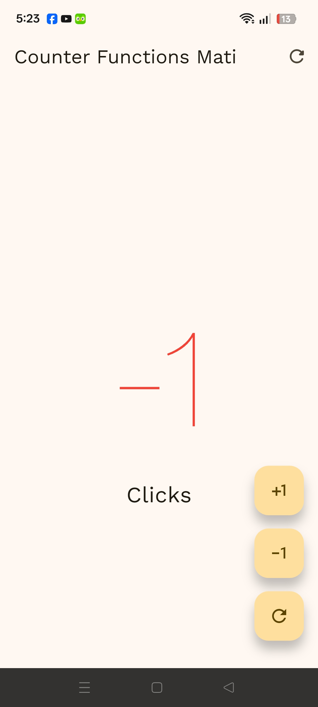
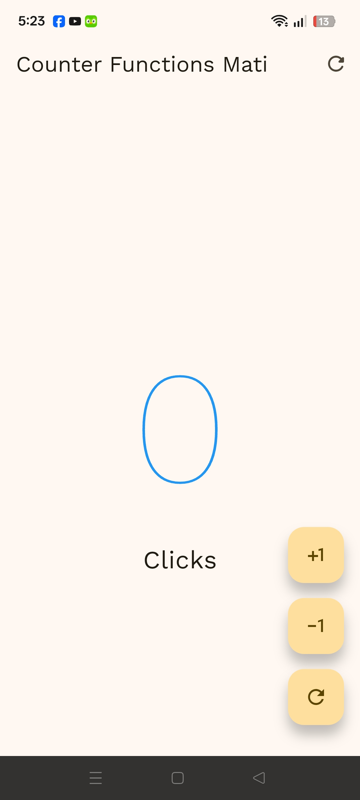
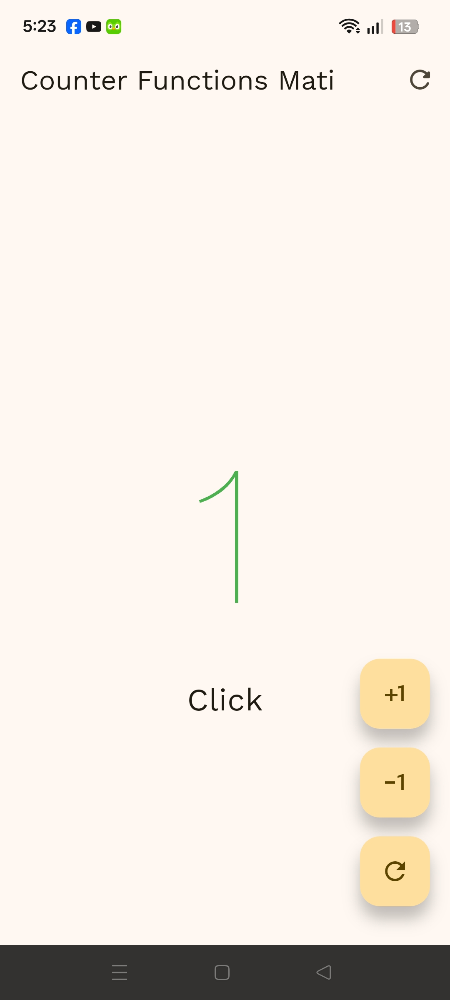

# 📱 Bitácora de Aprendizaje: Flutter + OpenAI Codex + Archify

[](#)
[](#)
[](#)
[](#)

* **Proyecto:** `hello_world_app`  
* **Asignatura:** Desarrollo Móvil Integral  
* **Fecha:** 14 de Septiembre de 2026  

---

## 📝 Descripción

Este repositorio contiene el desarrollo de la aplicación **`hello_world_app`**, un contador interactivo construido en **Flutter** y **Dart**. Además de implementar la lógica de estado y personalizaciones de UI, la práctica integra un flujo de trabajo de desarrollo asistido por Inteligencia Artificial utilizando **OpenAI Codex CLI** y **Archify** para la inspección de código y mapeo de arquitectura de software.

---

## 🎯 Objetivo

- Desarrollar una interfaz móvil interactiva de contador utilizando widgets reactivos (`StatefulWidget`, `StatelessWidget`), tipografía personalizada (*Architext*) y retroalimentación física y auditiva del dispositivo.
- Configurar y utilizar agentes de IA en consola (**Codex CLI**) para auditar e inspeccionar la estructura interna de la capa de presentación (`lib/`).
- Generar y desplegar diagramas de arquitectura web e interactivos automatizados mediante **Archify** para documentar el comportamiento de la aplicación.

---

## ⚙️ ¿Qué se realizó?

Durante la sesión de desarrollo e integración se llevaron a cabo las siguientes actividades:

1. **Desarrollo de Interfaz y Lógica Móvil:**
   - Creación de componentes reutilizables como `CustomButton`.
   - Organización de pantallas en la capa de presentación dentro de `CounterFunctionsScreen`.
   - Implementación de retroalimentación de sistema mediante sonidos (`SystemSound.play()`) y vibración háptica (`HapticFeedback.vibrate()`).
   - Lógica de cambio de color condicional según el valor actual del contador.

2. **Automatización con Agentes de IA (Codex CLI):**
   - Vinculación y autenticación con la consola a través de `codex login`.
   - Ejecución controlada en entorno *non-admin sandbox* para garantizar la seguridad en permisos de lectura/escritura.
   - Diseño de prompts estructurados para delimitar el análisis únicamente a los archivos de interfaz dentro del directorio `lib/`.

3. **Generación de Diagrama de Arquitectura:**
   - Extracción del árbol de widgets e interacciones para compilar un mapa interactivo en formato HTML (`architecture-diagram.html`).

---

## 📁 Archivos Principales Modificados

| Archivo | Descripción / Responsabilidad |
| :--- | :--- |
| `lib/main.dart` | Configuración principal de la aplicación, definición del tema visual, carga de la fuente personalizada *Architext* y asignación de la pantalla inicial. |
| `lib/presentation/screens/counter/counter_functions_screen.dart` | Contiene la lógica del contador, eventos de botones, colores condicionales según el valor numérico y la gestión del estado reactivo. |
| `pubspec.yaml` | Registro y configuración de dependencias y de la tipografía personalizada utilizada en la interfaz de la aplicación. |

---

## 📐 Arquitectura

El flujo de interacción de la aplicación se basa en la arquitectura: **UI / Eventos de Usuario ➔ Componentes ➔ Servicios del Sistema**.

Puedes consultar la representación interactiva de la arquitectura generada por **Archify** en el siguiente enlace:

🔗 **[Ver Diagrama Interactivo de Arquitectura en GitHub Pages](https://EMATIAS230045.github.io/Practicas_DMI_230045/Practica02/hello_world_app/Arquitecture/architecture-diagram.html)**

> *(Nota: Reemplaza la URL anterior por el enlace público correspondiente a tu repositorio en GitHub Pages).*

---

## 📸 Evidencias

A continuación se presentan las capturas de pantalla del comportamiento de la aplicación en sus distintos estados:

### 1. Contador con Valor Negativo
*Representación visual cuando el contador disminuye por debajo de cero (cambio condicional de estilo/color).*

<!-- Agrega tu imagen aquí cambiando el path -->


---

### 2. Contador en Cero
*Estado inicial de la aplicación al reiniciar o al iniciar por primera vez.*



---

### 3. Contador con Valor Positivo
*Comportamiento de la interfaz al incrementar el valor del contador.*



---
## 💻 Comandos Clave Utilizados

```cmd
:: Instalación de herramientas globales
npm install -g archify
npm install -g @openai/codex

:: Vinculación con cuenta de ChatGPT
codex login

:: Generación de diagrama interactivo de la carpeta lib/
codex "Use Archify to create an interactive architecture diagram of this Flutter application based on its lib/ folder structure. Output as interactive HTML."
```
